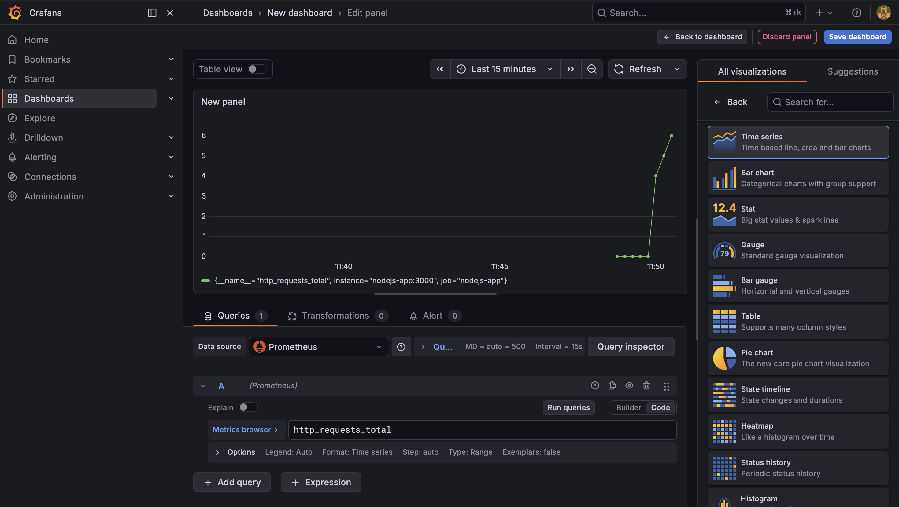
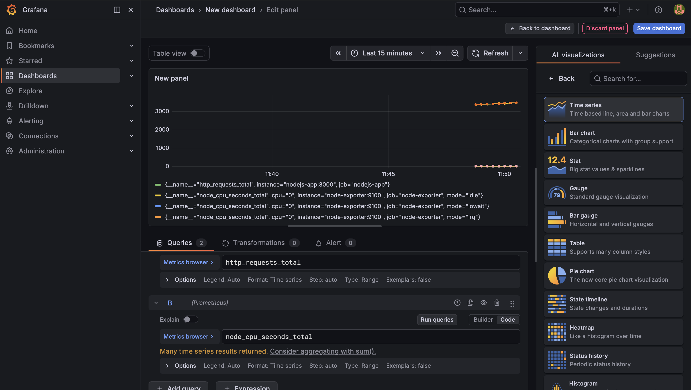

# 🔭 Prometheus & Grafana Monitoring Stack for Node.js

This project demonstrates a fully functional observability stack built with Prometheus, Grafana, Node Exporter, and a custom Node.js application exposing metrics. The goal is to showcase how modern monitoring pipelines collect, store, and visualize real‑time application and system metrics.

## 🛠 Stack Overview
### 1. Node.js Application

A simple web server instrumented with Prometheus client metrics, exposing:

- ```http_requests_total```

- ```http_request_duration_seconds``` 

- Default process metrics (CPU, memory, event loop lag)

- Metrics endpoint: ```/metrics```

### 2. Prometheus

Prometheus is responsible for scraping metrics from:

- Node.js application

- Node Exporter

- Prometheus itself

It is configured with a 5‑second scrape interval for near real‑time updates.

### 3. Node Exporter

Node Exporter collects host‑level system metrics such as:

- CPU usage

- Memory usage

- Disk I/O

- Network statistics

### 4. Grafana

Grafana is used to visualize Prometheus metrics with custom dashboards.

## 📦 Docker Compose Architecture
The entire monitoring stack runs via Docker Compose:

- Each service runs in its own container.

- Prometheus scrapes services using Docker DNS.

- Grafana connects to Prometheus as a data source.

- Node.js app exposes metrics on port 3000.

This setup simulates a real‑world microservices monitoring environment.

## 🚀 How to Run
### 1. Start the stack

```
docker-compose up --build
```

### 2. Access the services

| Service | URL |  
| :--- | :--- | 
| **Node.js App** | [http://localhost:3000](http://localhost:3000) | 
| **Metrics Endpoint** | [http://localhost:3000/metrics](http://localhost:3000/metrics) | 
| **Prometheus UI** | [http://localhost:9090](http://localhost:9090) | 
| **Grafana UI** | [http://localhost:3001](http://localhost:3001) | 


## 📊 Monitoring in Action
Below are screenshots demonstrating that the monitoring pipeline is fully operational.

### 🔹 Grafana Dashboard

Live visualization of http_requests_total and system metrics:

 

 

_Note: These screenshots confirm that Prometheus is scraping data correctly, Grafana is connected, and the Node.js app along with Node Exporter are producing valid metrics._

## 🧠 Key Learning Outcomes
This project serves as a practical implementation of the observability patterns I work with:

- Metric Instrumentation: Custom Node.js metrics using Prometheus client libraries, integrated with default runtime monitors.

- Infrastructure as Code: Full stack deployment (Prometheus, Grafana, Node Exporter) orchestrated via Docker Compose.

- Target Management: Configuration of scrape jobs and service discovery within a containerized network.

- Dashboarding: Data visualization and PromQL querying to monitor application health and system-level resources.

  


